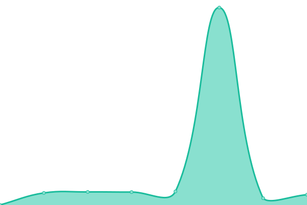

# [📈 Live Status](https://mguptahub.github.io/upptime): <!--live status--> **🟧 Partial outage**

This repository contains the open-source uptime monitor and status page for [Manish Gupta](https://mguptahub.github.io/upptime), powered by [Upptime](https://github.com/upptime/upptime).

With [Upptime](https://upptime.js.org), you can get your own unlimited and free uptime monitor and status page, powered entirely by a GitHub repository. We use [Issues](https://github.com/mguptahub/upptime/issues) as incident reports, [Actions](https://github.com/mguptahub/upptime/actions) as uptime monitors, and [Pages](https://mguptahub.github.io/upptime) for the status page.

<!--start: status pages-->
<!-- This summary is generated by Upptime (https://github.com/upptime/upptime) -->
<!-- Do not edit this manually, your changes will be overwritten -->
<!-- prettier-ignore -->
| URL | Status | History | Response Time | Uptime |
| --- | ------ | ------- | ------------- | ------ |
|  [Plane Website](https://www.plane.so) | 🟩 Up | [plane-website.yml](https://github.com/mguptahub/upptime/commits/HEAD/history/plane-website.yml) | 

 584ms
     
 | 

<a href="https://mguptahub.github.io/upptime/history/plane-website">100.00%</a>
    

|  [Plane Docs](https://docs.plane.so) | 🟩 Up | [plane-docs.yml](https://github.com/mguptahub/upptime/commits/HEAD/history/plane-docs.yml) | 

 256ms
     
 | 

<a href="https://mguptahub.github.io/upptime/history/plane-docs">100.00%</a>
    

|  [Plane Web](https://app.plane.so) | 🟩 Up | [plane-web.yml](https://github.com/mguptahub/upptime/commits/HEAD/history/plane-web.yml) | 

 207ms
     
 | 

<a href="https://mguptahub.github.io/upptime/history/plane-web">100.00%</a>
    

|  [Plane API](https://api.plane.so) | 🟥 Down | [plane-api.yml](https://github.com/mguptahub/upptime/commits/HEAD/history/plane-api.yml) | 

 183ms
     
 | 

<a href="https://mguptahub.github.io/upptime/history/plane-api">100.00%</a>
    

|  [Plane Prime](https://prime.plane.so) | 🟩 Up | [plane-prime.yml](https://github.com/mguptahub/upptime/commits/HEAD/history/plane-prime.yml) | 

 296ms
     
 | 

<a href="https://mguptahub.github.io/upptime/history/plane-prime">100.00%</a>
    

|  [Plane Disco](https://disco.plane.so) | 🟩 Up | [plane-disco.yml](https://github.com/mguptahub/upptime/commits/HEAD/history/plane-disco.yml) | 

 261ms
     
 | 

<a href="https://mguptahub.github.io/upptime/history/plane-disco">100.00%</a>
    

<!--end: status pages-->

[**Visit our status website →**](https://mguptahub.github.io/upptime)

## 📄 License

- Powered by: [Upptime](https://github.com/upptime/upptime)
- Code: [MIT](./LICENSE) © [Anand Chowdhary](https://anandchowdhary.com), supported by [Pabio](https://pabio.com)
- Data in the `./history` directory: [Open Database License](https://opendatacommons.org/licenses/odbl/1-0/)
